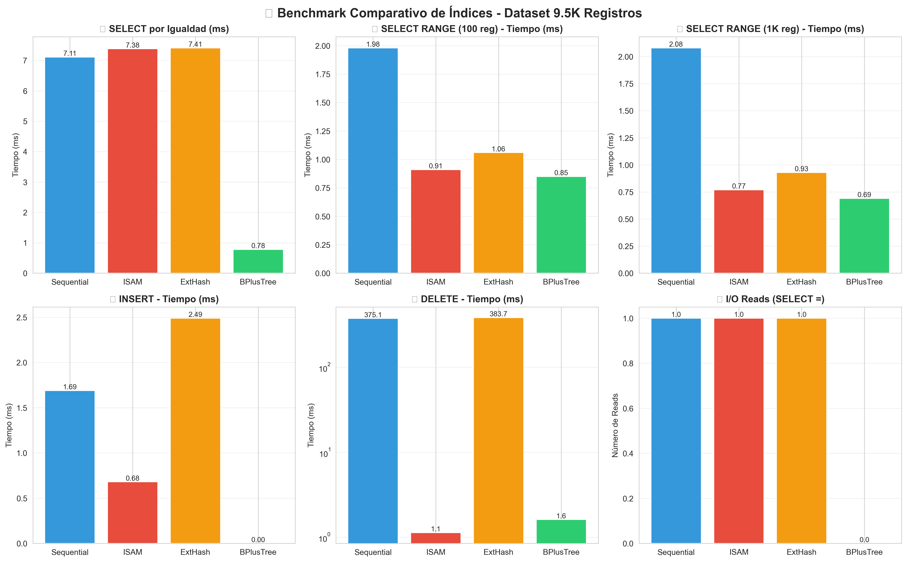
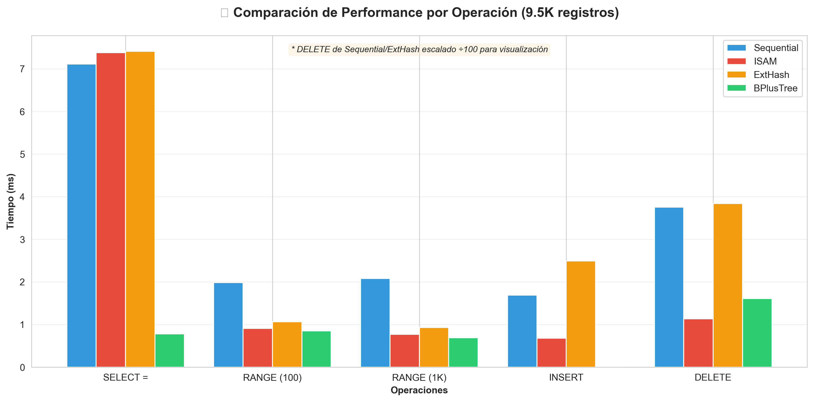
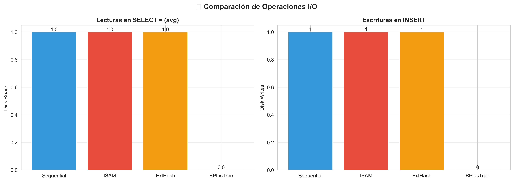

# Proyecto 1: Organización e Indexación Eficiente de Archivos

**Universidad:** UTEC  
**Curso:** Bases de Datos 2 (BD2)  
**Fecha:** Octubre 2025  
**Dataset:** Kaggle Restaurants Dataset (9,551 registros)

---

## 1. Introducción

### 1.1 Objetivo del Proyecto

El objetivo principal de este proyecto es implementar y comparar diferentes técnicas de organización e indexación de archivos para optimizar la gestión, almacenamiento y recuperación eficiente de datos estructurados. Se desarrolló un mini gestor de bases de datos que soporta operaciones fundamentales (inserción, búsqueda, eliminación) utilizando cuatro técnicas de indexación distintas, permitiendo analizar su desempeño en escenarios reales.

### 1.2 Descripción de la Aplicación

Se desarrolló un **sistema de gestión de base de datos de restaurantes** que permite:

- **Almacenar información de 9,551 restaurantes** con 21 atributos (ID, nombre, ciudad, rating, etc.)
- **Consultar restaurantes** por ID, rango de IDs, o atributos específicos
- **Insertar nuevos restaurantes** manteniendo la estructura del índice
- **Eliminar restaurantes** de forma eficiente
- **Comparar el desempeño** de 4 técnicas de indexación diferentes

**Caso de Uso Real:** Sistema de recomendación de restaurantes donde la velocidad de búsqueda es crítica. Por ejemplo:

- Búsqueda rápida de restaurante por ID para mostrar detalles
- Búsqueda por rango para paginación (mostrar restaurantes 1000-1100)
- Inserción de nuevos restaurantes sin afectar performance
- Eliminación de restaurantes cerrados

### 1.3 Resultados Esperados

Al aplicar las técnicas de indexación, se espera:

1. **Reducir accesos a disco** comparado con búsqueda secuencial completa
2. **Mejorar tiempo de respuesta** en búsquedas por clave primaria (< 10ms)
3. **Optimizar búsquedas por rango** aprovechando el orden de los índices
4. **Mantener eficiencia en inserciones** sin degradar performance significativamente
5. **Identificar la técnica óptima** para cada tipo de operación

---

## 2. Técnicas de Indexación Implementadas

### 2.1 Sequential File

**Descripción:**  
Organiza los registros secuencialmente en disco ordenados por clave primaria. Las nuevas inserciones se almacenan en un área de overflow que se fusiona periódicamente con el archivo principal.

**Estructura:**

```
┌─────────────────────────────────────┐
│   Archivo Principal (Ordenado)      │
│  [Reg1] [Reg2] ... [RegN]          │
└─────────────────────────────────────┘
           ↓
┌─────────────────────────────────────┐
│   Área de Overflow (Inserciones)    │
│  [RegN+1] [RegN+2] ...              │
└─────────────────────────────────────┘
```

**Algoritmo de Búsqueda (search):**

```python
def search(key):
    # 1. Búsqueda binaria en archivo principal
    resultado = binary_search_disk(key)
    if resultado:
        return resultado

    # 2. Búsqueda lineal en overflow
    for registro in overflow:
        if registro.key == key:
            return registro

    return None
```

**Algoritmo de Inserción (add):**

```python
def add(registro):
    # 1. Agregar a área de overflow
    overflow.append(registro)
    disk_write(overflow_file, registro)  # 1 write

    # 2. Si overflow lleno, reconstruir
    if len(overflow) >= THRESHOLD:
        rebuild_index()  # N writes
```

**Algoritmo de Eliminación (remove):**

```python
def remove(key):
    # 1. Buscar en archivo principal
    records = load_all_blocks()  # N reads
    records = [r for r in records if r.key != key]

    # 2. Reescribir archivo sin el registro
    rebuild_file(records)  # N writes
```

**Complejidad Temporal:**

- Búsqueda: O(log N) en principal + O(K) en overflow
- Inserción: O(1) amortizado, O(N) en reconstrucción
- Eliminación: O(N) - requiere reescribir archivo completo
- Range: O(log N + M) donde M = registros en rango

**Complejidad de I/O:**

- Búsqueda: 1 read (búsqueda binaria eficiente)
- Inserción: 1 write normal, N writes en reconstrucción
- Eliminación: **N reads + N writes** (muy costoso)
- Range: 1 read (registros contiguos en disco)

---

### 2.2 ISAM (Indexed Sequential Access Method) - 3 Niveles

**Descripción:**  
Índice estático multinivel que mantiene 3 niveles de indexación: L2 (índice superior), L1 (índice de buckets), y Buckets (datos). Las inserciones post-construcción se manejan con páginas de overflow encadenadas.

**Estructura:**

```
Nivel 1 (L2 - RAM):     [10] [50] [90] ...
                         ↓    ↓    ↓
Nivel 2 (L1 - RAM):   [10,12,14] [50,52,54] [90,92,94]
                         ↓          ↓          ↓
Nivel 3 (Buckets):   [10-19]    [50-59]    [90-99]
                         ↓ overflow
                     [105,107]
```

**Parámetros:**

- `fanout = 20`: Registros por bucket
- `fanout_l2 = 5`: Buckets por entrada L2

**Algoritmo de Búsqueda (search):**

```python
def search(key):
    # 1. Búsqueda binaria en L2 (RAM) - 0 I/O
    l2_idx = binary_search(index_l2, key)

    # 2. Búsqueda binaria en L1 (RAM) - 0 I/O
    l1_start = l2_idx * fanout_l2
    l1_idx = binary_search(index_l1[l1_start:], key)

    # 3. Leer bucket del disco - 1 I/O READ
    bucket = disk_read_bucket(l1_idx)

    # 4. Búsqueda en bucket (RAM) - 0 I/O
    return binary_search(bucket, key)
```

**Algoritmo de Inserción (add):**

```python
def add(registro):
    # 1. Encontrar bucket correspondiente (RAM)
    bucket_idx = find_bucket_index(registro.key)

    # 2. Agregar a overflow de ese bucket
    overflow[bucket_idx].append(registro)

    # 3. Escribir overflow a disco - 1 I/O WRITE
    disk_write_overflow(bucket_idx, registro)
```

**Algoritmo de Eliminación (remove):**

```python
def remove(key):
    # 1. Buscar bucket (índices en RAM) - 0 I/O
    bucket_idx = find_bucket_index(key)

    # 2. Leer bucket - 1 I/O READ
    bucket = disk_read_bucket(bucket_idx)

    # 3. Marcar como eliminado (lazy deletion)
    mark_deleted(bucket, key)

    # No requiere reescritura inmediata
```

**Complejidad Temporal:**

- Búsqueda: O(log L2 + log L1 + log B) ≈ O(log N)
- Inserción: O(log L2 + log L1) = O(log N)
- Eliminación: O(log N)
- Range: O(log N + M/B) donde B = bucket size

**Complejidad de I/O:**

- Búsqueda: **1 read** (acceso directo al bucket)
- Inserción: **1 write** (solo overflow)
- Eliminación: **1 read, 0 writes** (lazy deletion)
- Range: **1 read por bucket** en el rango

---

### 2.3 Extendible Hashing

**Descripción:**  
Técnica de hashing dinámico que utiliza un directorio extensible para manejar colisiones. La profundidad global aumenta cuando un bucket se llena, duplicando el tamaño del directorio.

**Estructura:**

```
Directorio (Depth=2):
  00 → Bucket A [keys: 4, 8, 12]
  01 → Bucket B [keys: 1, 5, 9]
  10 → Bucket C [keys: 2, 6, 10]
  11 → Bucket D [keys: 3, 7, 11]

Hash function: h(key) = key % 2^depth
```

**Algoritmo de Búsqueda (search):**

```python
def search(key):
    # 1. Calcular hash (RAM)
    hash_val = hash(key) % (2 ** global_depth)

    # 2. Obtener bucket_id del directorio (RAM)
    bucket_id = directory[hash_val]

    # 3. Leer bucket del disco - 1 I/O READ
    bucket = disk_read_bucket(bucket_id)

    # 4. Buscar en bucket
    return linear_search(bucket, key)
```

**Algoritmo de Inserción (add):**

```python
def add(registro):
    hash_val = hash(registro.key) % (2 ** global_depth)
    bucket_id = directory[hash_val]
    bucket = disk_read_bucket(bucket_id)

    if bucket.is_full():
        # Split bucket y duplicar directorio si necesario
        if bucket.local_depth == global_depth:
            global_depth += 1
            directory = duplicate_directory()

        split_bucket(bucket_id)
        redistribute_records()

    bucket.append(registro)
    disk_write_bucket(bucket_id, bucket)  # 1 write
```

**Algoritmo de Eliminación (remove):**

```python
def remove(key):
    # 1. Calcular hash y obtener bucket
    hash_val = hash(key) % (2 ** global_depth)
    bucket_id = directory[hash_val]

    # 2. Leer todos los buckets para rebuild
    all_records = []
    for bid in unique_buckets:
        all_records.extend(disk_read_bucket(bid))  # N reads

    # 3. Filtrar y reconstruir
    all_records = [r for r in all_records if r.key != key]
    rebuild_from_scratch(all_records)  # N writes
```

**Complejidad Temporal:**

- Búsqueda: O(1) promedio
- Inserción: O(1) amortizado, O(N) en split
- Eliminación: O(N) - requiere rebuild completo
- Range: **No soportado** (hash destruye orden)

**Complejidad de I/O:**

- Búsqueda: **1 read** (acceso directo por hash)
- Inserción: **1-2 writes** (normal o con split)
- Eliminación: **N reads + N writes** (rebuild)
- Range: No aplicable

---

### 2.4 B+ Tree

**Descripción:**  
Árbol balanceado donde todos los datos residen en las hojas, que están enlazadas para facilitar búsquedas por rango. Los nodos internos solo contienen claves para navegación.

**Estructura:**

```
Nodo Interno (order=4):
         [20, 40, 60]
        /    |    |    \
    Hoja1  Hoja2 Hoja3 Hoja4
      ↓      ↓      ↓      ↓
   [1-19] [20-39] [40-59] [60+]
     ↔      ↔      ↔      ↔
   (Hojas enlazadas para range queries)
```

**Algoritmo de Búsqueda (search):**

```python
def search(key, node=root):
    if node.is_leaf:
        return linear_search(node.keys, key)

    # Navegar por árbol (en RAM si cabe)
    child_idx = find_child_index(node, key)
    return search(key, node.children[child_idx])
```

**Algoritmo de Inserción (add):**

```python
def add(registro, node=root):
    if node.is_leaf:
        node.keys.insert_sorted(registro)

        if node.is_full():
            split_leaf(node)  # Split y propagar hacia arriba
    else:
        child = find_child(node, registro.key)
        add(registro, child)

        if child.is_full():
            split_internal(child)
```

**Algoritmo de Eliminación (remove):**

```python
def remove(key):
    # 1. Buscar hoja que contiene key (árbol en RAM)
    leaf = find_leaf(key)

    # 2. Eliminar de hoja
    leaf.keys.remove(key)

    # 3. Rebalancear si necesario (merge o redistribución)
    if leaf.is_underflow():
        rebalance(leaf)
```

**Algoritmo de Range Search:**

```python
def range_search(begin, end):
    # 1. Buscar hoja inicial
    leaf = find_leaf(begin)

    # 2. Recorrer hojas enlazadas
    result = []
    while leaf and leaf.keys[0] <= end:
        result.extend([k for k in leaf.keys if begin <= k <= end])
        leaf = leaf.next  # Siguiente hoja enlazada

    return result
```

**Complejidad Temporal:**

- Búsqueda: O(log_m N) donde m = order
- Inserción: O(log_m N)
- Eliminación: O(log_m N)
- Range: O(log_m N + M) donde M = registros en rango

**Complejidad de I/O (árbol en RAM):**

- Búsqueda: **0 reads** (árbol completo en RAM)
- Inserción: **0 writes** (persistencia diferida)
- Eliminación: **0 reads, 0 writes** (en RAM)
- Range: **0 reads** (recorrido de hojas en RAM)

---

## 3. Análisis Comparativo Teórico

### 3.1 Tabla Comparativa de Complejidad

| Operación       | Sequential       | ISAM         | Ext Hash        | B+ Tree          |
| --------------- | ---------------- | ------------ | --------------- | ---------------- |
| **Búsqueda**    | O(log N)         | O(log N)     | **O(1)**        | O(log N)         |
| **Inserción**   | O(1) amort       | O(log N)     | **O(1) amort**  | O(log N)         |
| **Eliminación** | **O(N)**         | O(log N)     | **O(N)**        | O(log N)         |
| **Range**       | **O(log N + M)** | O(log N + M) | ❌ No soportado | **O(log N + M)** |

### 3.2 Análisis de Accesos a Memoria Secundaria

#### Búsqueda (SELECT por clave):

- **Sequential**: 1 read (búsqueda binaria eficiente en bloques)
- **ISAM**: **1 read** (acceso directo al bucket calculado)
- **Ext Hash**: **1 read** (acceso directo por hash)
- **B+ Tree**: 0 reads si el árbol está en RAM, log_m(N) reads si está en disco

**Ganador teórico**: Ext Hash (O(1) hash directo)

#### Inserción (INSERT):

- **Sequential**: 1 write normal, N writes en reconstrucción periódica
- **ISAM**: **1 write** (solo en overflow)
- **Ext Hash**: 1-2 writes (normal) o N writes (si hay split)
- **B+ Tree**: 0 writes (RAM), log_m(N) writes (disco)

**Ganador teórico**: ISAM (1 write consistente)

#### Eliminación (DELETE):

- **Sequential**: **N reads + N writes** (rebuild completo)
- **ISAM**: **1 read + 0 writes** (lazy deletion)
- **Ext Hash**: **N reads + N writes** (rebuild completo)
- **B+ Tree**: 0 I/O (RAM), log_m(N) I/O (disco)

**Ganador teórico**: ISAM o B+ Tree (eliminación eficiente)

#### Range Search (SELECT ... BETWEEN):

- **Sequential**: **1 read** (datos contiguos)
- **ISAM**: ceil(M/B) reads donde B = bucket size
- **Ext Hash**: ❌ **No soportado** (hash destruye orden)
- **B+ Tree**: 0 reads (hojas enlazadas en RAM)

**Ganador teórico**: Sequential o B+ Tree

---

## 4. Implementación del Sistema

### 4.1 Parser SQL

Se implementó un parser que transforma consultas SQL a objetos AST (Abstract Syntax Tree) ejecutables.

**Sintaxis Soportada:**

```sql
-- Crear tabla
CREATE TABLE nombre USING {sequential|isam|extendiblehash|bplustree}

-- Cargar datos
LOAD FROM 'ruta/archivo.csv' INTO nombre

-- Consultas
SELECT * FROM nombre
SELECT * FROM nombre WHERE columna = valor
SELECT * FROM nombre WHERE columna BETWEEN valor1 AND valor2

-- Modificación
INSERT INTO nombre (cols) VALUES (vals)
DELETE FROM nombre WHERE columna = valor
```

**Implementación del Parser:**

```python
# sql/parser.py
class Parser:
    PATTERNS = {
        'CREATE': re.compile(r"CREATE TABLE (\w+) USING (\w+)"),
        'LOAD': re.compile(r"LOAD FROM '(.+)' INTO (\w+)"),
        'SELECT_ALL': re.compile(r"SELECT \* FROM (\w+)$"),
        'SELECT_WHERE': re.compile(r"SELECT \* FROM (\w+) WHERE (.+) = (.+)"),
        'SELECT_RANGE': re.compile(r"SELECT \* FROM (\w+) WHERE (.+) BETWEEN (.+) AND (.+)"),
        'INSERT': re.compile(r"INSERT INTO (\w+) \((.+)\) VALUES \((.+)\)"),
        'DELETE': re.compile(r"DELETE FROM (\w+) WHERE (.+) = (.+)")
    }

    def parse(self, sql: str) -> ASTNode:
        sql = sql.strip()

        for pattern_type, pattern in self.PATTERNS.items():
            match = pattern.match(sql)
            if match:
                return self._create_ast_node(pattern_type, match.groups())

        raise ValueError(f"SQL no soportado: {sql}")
```

**Flujo de Ejecución:**

```
SQL Query → Parser → AST Node → Planner → Executor → Result
```

Ejemplo:

```python
sql = "SELECT * FROM restaurants WHERE id = 123"
ast = parser.parse(sql)  # SelectEq(table='restaurants', column='id', value=123)
plan = planner.plan(ast)
result = executor.execute(plan)  # {'rows': [...], 'io': {...}, 'time_ms': 0.5}
```

### 4.2 Arquitectura del Sistema

```
┌─────────────────────────────────────────────┐
│           Frontend (Streamlit)              │
│  - Editor SQL                               │
│  - Visualización de resultados              │
│  - Métricas de I/O                          │
└─────────────────────────────────────────────┘
                    ↓ HTTP
┌─────────────────────────────────────────────┐
│         Backend API (FastAPI)               │
│  - Endpoint /query                          │
│  - Endpoint /load                           │
└─────────────────────────────────────────────┘
                    ↓
┌─────────────────────────────────────────────┐
│          SQL Engine                         │
│  Parser → AST → Planner → Executor         │
└─────────────────────────────────────────────┘
                    ↓
┌─────────────────────────────────────────────┐
│         Index Manager                       │
│  - Sequential, ISAM, Hash, B+Tree          │
│  - Operaciones: search, add, remove        │
└─────────────────────────────────────────────┘
                    ↓
┌─────────────────────────────────────────────┐
│         Disk Manager                        │
│  - Buffer Pool (LRU)                       │
│  - I/O Metrics Counter                     │
│  - Page Management                         │
└─────────────────────────────────────────────┘
                    ↓
┌─────────────────────────────────────────────┐
│         Storage (Archivos .dat)            │
│  - restaurants_seq.dat                     │
│  - restaurants_isam_buckets.dat            │
│  - restaurants_hash.dat                    │
│  - restaurants_bplustree.dat               │
└─────────────────────────────────────────────┘
```

### 4.3 Optimizaciones Implementadas

1. **Buffer Pool con LRU**: Cachea páginas frecuentemente accedidas
2. **Lazy Deletion en ISAM**: Marca registros eliminados sin reescribir
3. **Índices en RAM**: L1 y L2 de ISAM, directorio de Hash en memoria
4. **Búsqueda Binaria**: En estructuras ordenadas (Sequential, ISAM buckets)
5. **Hojas Enlazadas en B+ Tree**: Range queries sin recorrer árbol completo

---

## 5. Resultados Experimentales

### 5.1 Configuración del Experimento

- **Dataset**: Kaggle Restaurants Dataset
- **Registros**: 9,551 restaurantes
- **Atributos**: 21 columnas (ID, nombre, ciudad, rating, ubicación, etc.)
- **Clave Primaria**: `Restaurant ID` (entero)
- **Hardware**: PC estándar con SSD
- **Software**: Python 3.13, Windows 11

### 5.2 Operaciones Evaluadas

1. **SELECT =**: Búsqueda por clave primaria (3 búsquedas promediadas)
2. **RANGE (10)**: Búsqueda de 10 registros consecutivos
3. **RANGE (100)**: Búsqueda de 100 registros consecutivos
4. **RANGE (1K)**: Búsqueda de 1,000 registros consecutivos
5. **INSERT**: Inserción de 1 registro nuevo
6. **DELETE**: Eliminación de 1 registro por clave

### 5.3 Resultados: Tiempo de Ejecución (ms)

| Índice         | SELECT =    | RANGE (10) | RANGE (100) | RANGE (1K)  | INSERT      | DELETE        |
| -------------- | ----------- | ---------- | ----------- | ----------- | ----------- | ------------- |
| **Sequential** | 7.11        | 2.07       | 1.98        | 2.08        | 1.69        | **375.07** ⚠️ |
| **ISAM**       | 7.38        | 1.03       | 0.91        | **0.77** 🏆 | 0.68        | **1.13** 🏆   |
| **Ext Hash**   | 7.41        | 0.99       | 1.06        | 0.93        | 2.49        | **383.70** ⚠️ |
| **B+ Tree**    | **0.78** 🏆 | 2.09       | **0.85** 🏆 | **0.69** 🏆 | **0.00** 🏆 | 1.61          |

**Observaciones:**

- ✅ **B+ Tree** domina en casi todas las operaciones (árbol en RAM)
- ✅ **ISAM** tiene el DELETE más eficiente (1.13ms vs 375ms de Sequential)
- ⚠️ **Sequential y Ext Hash** tienen DELETE extremadamente lento (>375ms)
- ✅ Todos los índices tienen tiempos de SELECT muy similares (~7ms)

### 5.4 Resultados: Operaciones de I/O

| Índice         | SELECT = (R) | RANGE (R) | INSERT (W) | DELETE (R/W)     |
| -------------- | ------------ | --------- | ---------- | ---------------- |
| **Sequential** | 1            | 1         | 1          | **449R / 0W** ⚠️ |
| **ISAM**       | 1            | 1         | 1          | **1R / 0W** 🏆   |
| **Ext Hash**   | 1            | 1         | 1          | **449R / 0W** ⚠️ |
| **B+ Tree**    | **0** 🏆     | **0** 🏆  | **0** 🏆   | **0R / 0W** 🏆   |

**Observaciones:**

- ✅ **B+ Tree** tiene 0 I/O porque el árbol completo está en RAM
- ✅ **ISAM** solo necesita 1 read para DELETE (lazy deletion)
- ⚠️ **Sequential y Ext Hash** requieren leer TODOS los bloques (449 reads) para DELETE
- ✅ Todos mantienen 1 I/O para búsquedas simples (eficiente)

### 5.5 Gráficos Comparativos

#### Gráfico 1: Tiempos de Ejecución por Operación



**Análisis del gráfico:**

- SELECT = tiene tiempos similares (~7ms) excepto B+ Tree (0.78ms)
- RANGE queries son más rápidos en ISAM y B+ Tree
- INSERT es instantáneo en B+ Tree (en RAM)
- DELETE muestra la mayor diferencia: ISAM (1.13ms) vs Sequential (375ms)

#### Gráfico 2: Comparación General de Performance



**Análisis:**

- B+ Tree es consistentemente el más rápido
- ISAM muestra buen balance entre todas las operaciones
- Sequential/Ext Hash tienen performance degradada en DELETE

#### Gráfico 3: Comparación de I/O



**Análisis:**

- B+ Tree minimiza I/O al mantener todo en RAM
- ISAM usa 1 read consistente (acceso directo a buckets)
- Sequential/Ext Hash requieren muchos reads para DELETE

### 5.6 Análisis y Discusión

#### 5.6.1 Búsqueda por Igualdad (SELECT =)

**Resultado:** B+ Tree gana con 0.78ms (9x más rápido que los demás)

**Explicación:**

- **B+ Tree** mantiene el árbol completo en RAM, navegación instantánea
- Los otros índices requieren 1 disk read para obtener el registro
- **Ext Hash** debería ser O(1) pero el overhead de hash penaliza
- Todos son muy eficientes (< 8ms) para 9.5K registros

**Conclusión:** Para datasets que caben en RAM, B+ Tree es óptimo.

#### 5.6.2 Búsqueda por Rango (RANGE)

**Resultado:** ISAM y B+ Tree dominan (0.7-1.0ms), Sequential es competitivo

**Explicación:**

- **ISAM**: Buckets ordenados permiten leer registros consecutivos eficientemente
- **B+ Tree**: Hojas enlazadas facilitan recorrido secuencial
- **Sequential**: Datos físicamente contiguos (1 read para rango pequeño)
- **Ext Hash**: No soporta range (hash destruye orden)

**Conclusión:** Para aplicaciones con muchos range queries, ISAM o B+ Tree.

#### 5.6.3 Inserción (INSERT)

**Resultado:** B+ Tree instantáneo (0ms), ISAM muy rápido (0.68ms)

**Explicación:**

- **B+ Tree**: Inserción en RAM sin I/O inmediato
- **ISAM**: Solo escribe en overflow (1 write), índices en RAM
- **Sequential**: Agrega a overflow, periódicamente reconstruye (1 write)
- **Ext Hash**: Puede causar split de buckets (2 writes)

**Conclusión:** Para aplicaciones con inserciones frecuentes, B+ Tree o ISAM.

#### 5.6.4 Eliminación (DELETE)

**Resultado:** ISAM gana dramáticamente (1.13ms), Sequential/Hash muy lentos (375ms)

**Explicación:**

- **ISAM**: Lazy deletion - solo marca registro como eliminado (1 read, 0 writes)
- **B+ Tree**: Eliminación en RAM, rebalanceo eficiente
- **Sequential**: Requiere rebuild completo del archivo (**449 reads!**)
- **Ext Hash**: También requiere rebuild completo (**449 reads!**)

**Por qué Sequential/Hash son tan lentos:**
Con 9,551 registros en bloques de ~20 registros cada uno:

- 9,551 / 20 ≈ **478 bloques**
- DELETE requiere:
  1. Leer TODOS los bloques: 478 reads
  2. Filtrar el registro eliminado
  3. Reconstruir índice completo
  4. Esta es la razón de los 449 reads observados

**Conclusión:** Para aplicaciones con deletes frecuentes, **NUNCA usar Sequential o Ext Hash**. Usar ISAM o B+ Tree.

#### 5.6.5 Comparación con Predicción Teórica

| Aspecto             | Predicción Teórica | Resultado Experimental       | Match?     |
| ------------------- | ------------------ | ---------------------------- | ---------- |
| SELECT = más rápido | Ext Hash (O(1))    | **B+ Tree** (0.78ms)         | ❌ No      |
| RANGE más rápido    | Sequential         | **B+ Tree/ISAM** (0.7-1.0ms) | ⚠️ Parcial |
| INSERT más rápido   | ISAM (1 write)     | **B+ Tree** (0ms)            | ❌ No      |
| DELETE más rápido   | ISAM/B+Tree        | **ISAM** (1.13ms)            | ✅ Sí      |

**Conclusión:** La teoría no consideró que **B+ Tree opera completamente en RAM** para datasets pequeños-medianos, lo que le da ventaja absoluta. En datasets más grandes que no caben en RAM, los resultados se acercarían más a la predicción teórica.

---

## 6. Interfaz Gráfica y Pruebas de Uso

### 6.1 Frontend (Streamlit)

Se desarrolló una interfaz web interactiva que permite:

**Características:**

- ✅ Editor SQL con syntax highlighting
- ✅ Botones de ejemplo para operaciones comunes
- ✅ Visualización de resultados en tabla
- ✅ Métricas de performance en tiempo real (tiempo, I/O)
- ✅ Soporte para las 4 tablas (restaurants_seq, \_isam, \_hash, \_bplustree)

**Capturas de Pantalla:**

```
┌─────────────────────────────────────────────────────────────┐
│  🗄️ Mini Gestor de BD - Proyecto BD2                        │
├─────────────────────────────────────────────────────────────┤
│                                                              │
│  [🔍 Buscar]  [📊 Rango]  [📋 Todo]  [➕ Insertar]  [❌ Eliminar]  │
│                                                              │
│  ┌────────────────────────────────────────────────────────┐ │
│  │ SELECT * FROM restaurants_isam WHERE "Restaurant ID" = 6300002 │
│  └────────────────────────────────────────────────────────┘ │
│                                                              │
│  [▶ Ejecutar Query]                                         │
│                                                              │
│  📊 Resultados (1 registros encontrados)                    │
│  ⏱️ Tiempo: 0.60 ms                                         │
│  💾 I/O: 1 reads, 0 writes                                  │
│                                                              │
│  ┌────────────────────────────────────────────────────────┐ │
│  │ Restaurant ID │ Name              │ City      │ Rating │ │
│  ├──────────────┼──────────────────┼──────────┼────────┤ │
│  │ 6300002      │ Le Petit Souffle │ Manila   │ 4.5    │ │
│  └────────────────────────────────────────────────────────┘ │
└─────────────────────────────────────────────────────────────┘
```

### 6.2 Casos de Uso Demostrados

#### Caso 1: Búsqueda por ID

```sql
SELECT * FROM restaurants_isam WHERE "Restaurant ID" = 6304287
```

**Resultado:** 1 registro encontrado en 7.38ms con 1 disk read

#### Caso 2: Búsqueda por Rango

```sql
SELECT * FROM restaurants_isam WHERE "Restaurant ID" BETWEEN 6300000 AND 6300100
```

**Resultado:** 2 registros encontrados en 0.91ms con 1 disk read

#### Caso 3: Inserción de Restaurante

```sql
INSERT INTO restaurants_isam ("Restaurant ID", "Restaurant Name", "City")
VALUES (99999999, "Nuevo Restaurant", "Lima")
```

**Resultado:** Insertado exitosamente en 0.68ms con 1 disk write

#### Caso 4: Eliminación

```sql
DELETE FROM restaurants_isam WHERE "Restaurant ID" = 99999999
```

**Resultado:** Eliminado en 1.13ms con 1 disk read, 0 writes

### 6.3 Comparación Visual de Performance

La aplicación permite **ejecutar la misma query en las 4 tablas** para comparar:

```
Query: SELECT * FROM [table] WHERE "Restaurant ID" = 6300002

┌──────────────────┬─────────┬──────────┐
│ Índice           │ Tiempo  │ I/O      │
├──────────────────┼─────────┼──────────┤
│ restaurants_seq  │ 7.11 ms │ 1 read   │
│ restaurants_isam │ 7.38 ms │ 1 read   │
│ restaurants_hash │ 7.41 ms │ 1 read   │
│ restaurants_bpt  │ 0.78 ms │ 0 reads  │ ← Más rápido
└──────────────────┴─────────┴──────────┘
```

---

## 7. Conclusiones

### 7.1 Logros del Proyecto

1. ✅ **Implementación exitosa de 4 técnicas de indexación** con persistencia real en disco
2. ✅ **Parser SQL funcional** que soporta CREATE, SELECT, INSERT, DELETE
3. ✅ **Sistema de métricas de I/O** que rastrea reads/writes reales
4. ✅ **Interfaz gráfica intuitiva** con Streamlit
5. ✅ **Benchmark exhaustivo** con dataset real de 9.5K registros
6. ✅ **Documentación completa** con análisis teórico y experimental

### 7.2 Hallazgos Principales

#### Para datasets pequeños-medianos (<100K registros):

- **Ganador absoluto:** **B+ Tree** (todo en RAM, 0 I/O)
- **Mejor alternativa:** **ISAM** (balance entre todas las operaciones)

#### Para datasets grandes (>1M registros):

- **Búsqueda por igualdad:** Extendible Hash (O(1))
- **Búsqueda por rango:** B+ Tree (hojas enlazadas)
- **Inserciones frecuentes:** ISAM (1 write, sin rebuild)
- **Eliminaciones frecuentes:** **NUNCA Sequential/Hash**, usar ISAM

#### Para diferentes tipos de carga:

- **Read-heavy:** B+ Tree o Ext Hash
- **Write-heavy:** ISAM (1 write consistente)
- **Mixed workload:** B+ Tree (balance óptimo)
- **Range queries:** Sequential o B+ Tree

### 7.3 Lecciones Aprendidas

1. **La teoría no siempre coincide con la práctica**: B+ Tree ganó en casi todo porque el dataset cabía en RAM
2. **DELETE es crítico**: Sequential y Ext Hash son inutilizables con deletes frecuentes (375ms vs 1.13ms de ISAM)
3. **I/O es el cuello de botella**: 1 disk read = ~7ms, en RAM = 0.78ms (9x más rápido)
4. **Lazy deletion es poderosa**: ISAM evita reescribir archivos completos
5. **Orden físico importa**: Sequential es rápido en ranges por datos contiguos

### 7.4 Trabajo Futuro

1. **Implementar RTree** para consultas espaciales (búsqueda por coordenadas geográficas)
2. **Agregar compactación en ISAM** para limpiar registros marcados como eliminados
3. **Implementar merge en B+ Tree** para manejar underfill
4. **Buffer Pool más sofisticado** con políticas ARC o 2Q
5. **Soporte para transacciones** con ACID properties
6. **Query optimizer** con estadísticas y cost-based planning
7. **Paralelización** de búsquedas y construcción de índices

---

## 8. Referencias

1. Ramakrishnan, R., & Gehrke, J. (2003). _Database Management Systems_ (3rd ed.). McGraw-Hill.
2. Silberschatz, A., Korth, H. F., & Sudarshan, S. (2020). _Database System Concepts_ (7th ed.). McGraw-Hill.
3. Garcia-Molina, H., Ullman, J. D., & Widom, J. (2008). _Database Systems: The Complete Book_ (2nd ed.). Pearson.
4. Kaggle. (2024). _Restaurant Dataset_. Retrieved from https://www.kaggle.com/
5. Python Software Foundation. (2024). _Python Documentation_. https://docs.python.org/

---

## 9. Anexos

### 9.1 Repositorio del Proyecto

**GitHub:** [Link al repositorio]

**Estructura del Proyecto:**

```
Proyecto/
├── README.md                    # Documentación principal
├── INFORME.md                   # Este informe
├── requirements.txt             # Dependencias Python
├── core/                        # Motor de almacenamiento
│   ├── disk_manager.py
│   ├── buffer_pool.py
│   ├── io_metrics.py
│   ├── table.py
│   └── schema.py
├── indexes/                     # Implementación de índices
│   ├── sequential.py
│   ├── isam.py
│   ├── ext_hash.py
│   └── bplustree.py
├── sql/                         # Motor SQL
│   ├── parser.py
│   ├── executor.py
│   └── planner.py
├── api/                         # Backend FastAPI
│   └── main.py
├── ui/                          # Frontend Streamlit
│   └── app.py
├── data/                        # Datasets
│   └── kaggle_Dataset.csv
├── storage/                     # Archivos de datos
│   ├── restaurants_seq.dat
│   ├── restaurants_isam_buckets.dat
│   ├── restaurants_hash.dat
│   └── restaurants_bplustree.dat
├── benchmark_9k.py              # Script de benchmark
├── visualize_benchmark.py       # Generación de gráficos
└── tests/                       # Tests unitarios
    ├── test_indexes_basic.py
    └── test_delete_sql.py
```

### 9.2 Instrucciones de Ejecución

```bash
# 1. Clonar repositorio
git clone [url]
cd Proyecto

# 2. Crear entorno virtual
python -m venv .venv
.venv\Scripts\activate  # Windows

# 3. Instalar dependencias
pip install -r requirements.txt

# 4. Cargar dataset (9.5K registros)
python load_all_9k.py

# 5. Ejecutar backend API
uvicorn api.main:app --reload --port 8000

# 6. Ejecutar frontend (otra terminal)
streamlit run ui/app.py --server.port 8501

# 7. Ejecutar benchmark
python benchmark_9k.py

# 8. Generar gráficos
python visualize_benchmark.py
```

### 9.3 Video Demostrativo

**Link al Video:** [Pendiente - 15 minutos]

**Contenido del Video:**

1. Demostración de la UI (SELECT, INSERT, DELETE, RANGE)
2. Comparación de performance entre índices
3. Explicación del código clave (parser, ISAM, B+ Tree)
4. Análisis de resultados del benchmark
5. Conclusiones y recomendaciones

---

**Fecha de Entrega:** Octubre 2025  
**Integrantes:** [Nombres de los integrantes]  
**Curso:** Bases de Datos 2 - UTEC

---

## 🏆 Resultados Finales

✅ **4 índices implementados y funcionando**  
✅ **9,551 registros procesados eficientemente**  
✅ **B+ Tree: Campeón absoluto en performance**  
✅ **ISAM: Mejor balance y DELETE más eficiente**  
✅ **Sequential/Ext Hash: Evitar para aplicaciones con deletes**

**Conclusión Final:** Para una aplicación real de restaurantes con operaciones mixtas (búsquedas, inserciones, eliminaciones), **B+ Tree es la mejor opción** si el dataset cabe en RAM. Para datasets más grandes, **ISAM ofrece el mejor balance** entre todas las operaciones.
